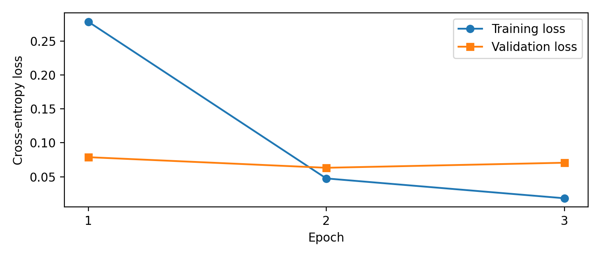
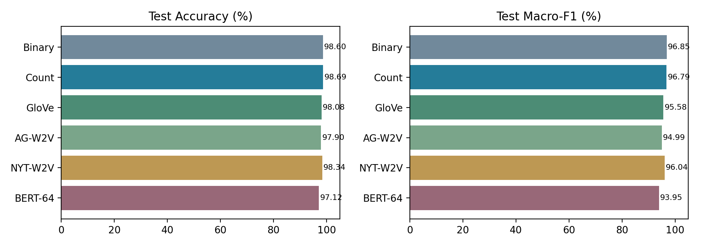
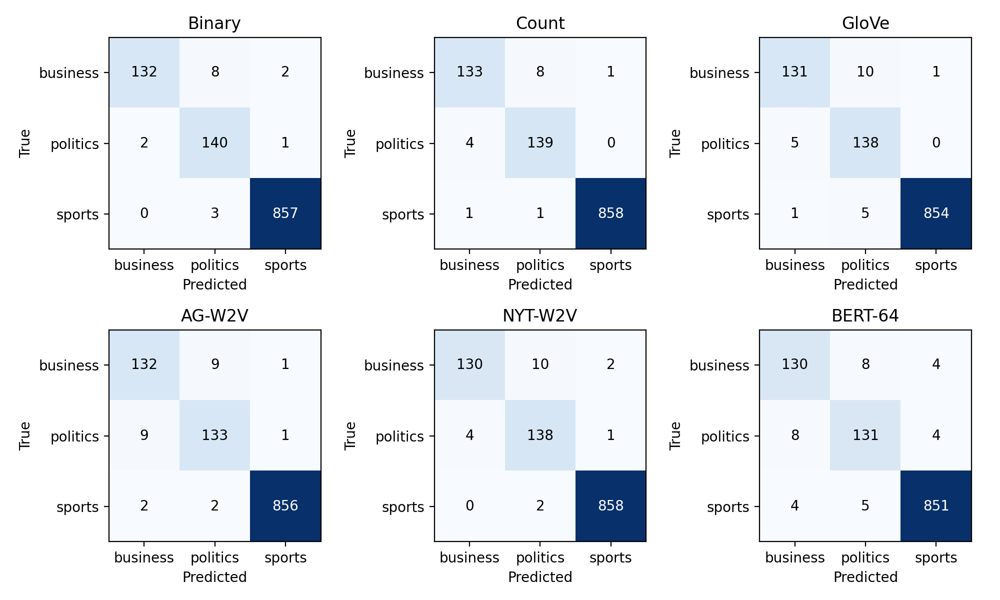

# 任务、数据与实验设计

## 研究问题与要求边界

本实验研究：新闻主题分类中，显式词项统计、平均词向量和预训练上下文表示分别带来什么收益与限制？比较重点不仅是总体准确率，也包括少数类别表现、数据来源、输入范围及错误原因。依据课程《作业一要求》，T1为30分、T2为50分、T3为20分；因此将GloVe、AG News词向量与NYT词向量三组均作为正式实验，而不把CBOW与Skip-gram两种架构误当作T2要求的三组来源。

文档中T1总述为“三种”，明细只列Binary BoW与Word Frequency两种。本报告完成两种明确要求，并将TF-IDF列为补充实验；这一处理不意味着老师已指定第三种就是TF-IDF。正式BERT实验严格采用64的最大输入长度和3个epoch，历史512长度实验仅作为补充观察。

## 数据清理与固定划分

NYT原始数据共11519条，字段为text和label。检查未发现空文本、缺失标签或相同文本对应冲突标签；有72条完全重复记录。为防止同一篇文章跨训练集与测试集造成记忆式收益，先按完整text去重，保留11447条。原始文件不修改。该预处理属于本实验的明确选择，正式文档并未要求去重，因此报告保留原始数与去重数供复核。

随后采用seed=42的分层随机抽样：先分出20%，再将这部分平分为验证集与测试集，得到近似80%/10%/10%。两次抽样均shuffle，符合先随机打乱的原则；分层额外保证类别比例接近。三个集合之间的完全相同文本交集为零。所有方法沿用同一row_id划分清单，不因模型表现重新划分。

| 集合 | business | politics | sports | 合计 |
| --- | --- | --- | --- | --- |
| train | 1134 | 1146 | 6877 | 9157 |
| valid | 141 | 144 | 860 | 1145 |
| test | 142 | 143 | 860 | 1145 |

row_id为原始CSV从0开始的数据行号，不包括表头。测试集sports占75.11%，而business与politics各约12.4%。始终预测sports即可取得75.11%的Accuracy，但Macro-F1仅28.60%，说明必须同时报告两种指标。

AG News提供90000条文本，去除29条完全重复记录后为89971条，与完整NYT的精确文本交集为零。AG只用于训练词向量，不使用标签。精确去重不能排除改写、近重复或同一事件报道；本实验未实施事件分组或时间外推划分，因此结论适用于当前随机划分。

## 评价、调参及信息隔离

```latex
\begin{align}
\mathrm{Accuracy}&=\frac{1}{N}\sum_{i=1}^N\mathbf{1}[y_i=\hat y_i],\\
P_k&=\frac{TP_k}{TP_k+FP_k},\quad R_k=\frac{TP_k}{TP_k+FN_k},\\
F_{1,k}&=\frac{2P_kR_k}{P_k+R_k},\quad
\mathrm{Macro\text{-}F1}=\frac{1}{3}\sum_{k=1}^3F_{1,k}.
\end{align}
```

分母为零时按0处理。Macro-F1先逐类计算再平均，不等于将平均Precision与平均Recall代入调和平均。表中指标均为百分数；“提高1个百分点”指两百分数直接相减。

词袋词表、TF-IDF的IDF、自训练NYT词向量都只拟合NYT训练集；AG词向量只拟合AG；公开GloVe作为固定外部资源。验证集仅用于选择C或BERT checkpoint，测试集不参与梯度更新、词表学习或超参数选择。所有方法均不在选择后合并训练集与验证集重训，以保持数据使用规则一致。

选参统一优先验证集Macro-F1，LR平分时取较小C，BERT平分时保留更早epoch。T1规定模型C取0.01、0.1、1；T2和补充TF-IDF取0.01至1000的六个十倍网格点。不同特征尺度对应的合理C不同，数值相同不代表正则化强度可直接比较。模型表现已被用于事后解释，新增消融也沿用原测试集，因此它们属于探索性分析，并非新测试集上的独立确认。

## 分类器与统一预处理

非BERT模型均使用小写化与正则分词，保留至少两个字母、数字或下划线组成的token；不删停用词，不做词干化。该规则对所有词袋和词向量方法一致。作业中的nltk.word_tokenize是可选建议，并非强制API；此处明确采用CountVectorizer分析器以统一实现。

LR采用One-vs-Rest、liblinear、L2正则、带截距、无类别权重、seed=42。每类分别拟合一个二元分类器，预测时取最大决策得分；不是将其误称为多项softmax回归。类别概率为OvR概率的归一化值，不能直接当作校准后的可靠度。达到最大迭代数的收敛警告会被转为错误；正式运行没有未处理的收敛警告。

```latex
s_k(d)=\boldsymbol w_k^\top\boldsymbol x_d+b_k,\qquad
\hat y=\arg\max_k s_k(d).
```

较大C代表较弱正则化。词袋max_iter=2000，新增T2与TF-IDF为5000，增大上限只用于保证求解收敛。对不均衡类别不加权是保持基线一致的选择，不代表类别加权无价值。

# Task 1：词袋表示及可解释性

## Binary、计数与补充TF-IDF

训练集词表大小为60947。Binary只记录某词是否出现，Count保留原始出现次数，不除以文档长度。例如词表为[team, win, market]，文档“team team win”分别得到[1,1,0]与[2,1,0]。未在训练词表出现的测试词被忽略。

```latex
x_{d,j}^{\mathrm{Binary}}=\mathbf{1}[c_{d,j}>0],\qquad
x_{d,j}^{\mathrm{Count}}=c_{d,j}.
```

Binary降低重复措辞的影响，但抹去了主题词密集程度；Count保留强度信息，也可能放大背景主题和长文章中重复词的作用。二者均不建模词序，无法直接区分“体育用于营销”与“营销涉及体育”的主次关系。

补充TF-IDF使用原始词频乘平滑IDF，再做逐文档L2归一化：

```latex
\operatorname{idf}(j)=\log\frac{1+N_{\mathrm{train}}}{1+\operatorname{df}(j)}+1,
\quad z_{d,j}=c_{d,j}\operatorname{idf}(j),\quad
\boldsymbol x_d=\boldsymbol z_d/\|\boldsymbol z_d\|_2.
```

IDF只用训练集。TF-IDF同时改变词项权重和向量尺度，因此若表现变化，不能单独归因于“抑制停用词”。

## 结果与参数选择

| 方法 | C | 验证Acc | 验证F1 | 测试Acc | 测试F1 | 错数 |
| --- | --- | --- | --- | --- | --- | --- |
| Binary | 1.0 | 98.52 | 96.31 | 98.60 | 96.85 | 16 |
| Count | 0.1 | 99.39 | 98.46 | 98.69 | 96.79 | 15 |
| TF-IDF | 100 | 99.30 | 98.23 | 99.04 | 97.53 | 11 |

Count的验证Macro-F1最高，因此按预定规则选Count作为T1主模型。测试集上Binary的Macro-F1反而比Count高约0.06个百分点，而Count少错1条；这并不矛盾，Macro-F1对各类等权，不只统计总错数。不能看到测试分数后反过来宣称Binary才是验证集选出的模型。

从Binary切换到Count修正8条错误，同时新增7条，说明不是单纯在原模型上“多猜对1篇”。Count把business正确数从132提升至133，却将politics正确数从140降至139，sports从857升至858；少数类之间的Precision/Recall变化使总体Accuracy与Macro-F1排序不同。

TF-IDF取得11条错误、测试Macro-F1为97.53%，相对Count修正6条并新增2条。它是本次测试上的最好点估计，但验证Macro-F1仍低于Count。后文配对区间跨零，因此不能把一次测试排名写成稳定优势，更不能用该补充结果替代两种规定实验。

## 训练权重与单篇贡献

| 类别 | Count正权重靠前的词 |
| --- | --- |
| business | company, european, flight, market, wasserman, business, its |
| politics | military, mr, washington, republican, law, obama, republicans |
| sports | players, league, team, game, football, season, club |

这些词揭示语料关联：体育类含players、league、team，商业类含company、market，政治类含military、washington、republican。词权重反映条件于当前训练集的预测关联，不是普遍词义，也不是因果作用。例如“mr”等称谓和功能词也进入模型，提示作者文风与栏目习惯可能成为捷径。

对错误类a与真实类b，使用决策差值而不是仅列某类最大权重：

```latex
s_a(d)-s_b(d)=(b_a-b_b)+\sum_j x_{d,j}(w_{a,j}-w_{b,j}).
```

每个词的贡献等于实际输入值乘类别权重差。正值推向错误类，负值支持真实类，截距也必须计入总差；只看单词系数而不乘出现次数会误判Count模型的证据。

row_id=4043实际为sports，讲女性退伍军人的高尔夫康复活动，Count误判politics。veterans出现19次，向错误类贡献+3.931；golf出现13次，支持真实类贡献-3.505；club的贡献为-2.356。模型同时识别两类信号，但整篇累积后的线性边界落在politics一侧。该例说明跨主题文章的叙事中心不能由是否出现体育词唯一确定。

row_id=4113真实business，讨论保险监管与既有保单。insurance出现14次却对politics相对business贡献+3.691，state贡献+2.198；companies、consumers分别贡献-1.161、-0.987。不能按日常常识把insurance自动视作商业词：本数据中保险与医疗政策报道高度相关，模型学到的是训练语境中的共现。完整词项贡献保存在T1结果JSON中，可回查而不是依赖主观猜测。

# Task 2：三种来源的100维词向量

## 三组实验的实现与来源

GloVe使用作业指定的glove.6B.100d.txt，共400000词、每词100维，来自斯坦福官方glove.6B.zip，而不是较新的2024版或其他维度。官方说明该6B模型由Wikipedia 2014与Gigaword 5语料训练。下载时只读取ZIP中的100d成员，并由ZIP CRC校验完整性；完整文件SHA-256保存在来源记录中。

GloVe利用全局词词共现统计学习表示；Word2Vec在局部上下文预测任务中学习向量。本实验两种自训练来源统一采用Skip-gram与负采样，固定100维、window=5、min_count=2、negative=5、sample=0.001、epochs=10、workers=1、seed=42，使用稳定CRC32词哈希。先按句末标点切分句子，再用统一分析器分词，以免窗口跨越无关句子。

AG组只在89971条AG文本训练；NYT组只用9157条NYT训练文本，复用已完成并校验过的同参数Skip-gram向量，不用验证集或测试集训练词向量。CBOW历史结果不属于作业规定的第四组，也不进入主结果排名。

## 文档池化、未知词与分类器

对文档中有向量的所有词取平均，重复出现的词重复参与求和；不存在向量的词跳过。这里分母为有效token数量，而不是原文词数或不同词的数量。全篇无已知词时使用100维零向量，并统计该情况；此次三组在所有划分中均没有零向量文档。

```latex
\mathcal I_d=\{i:w_i\in V_{\mathrm{emb}}\},\qquad
\boldsymbol h(d)=\frac{1}{|\mathcal I_d|}\sum_{i\in\mathcal I_d}\boldsymbol e(w_i).
```

正式结果直接用该平均向量训练LR，不额外归一化；L2归一化只作为独立补充消融。无监督词向量在分类阶段保持固定，不接受NYT标签的反向传播。100维平均向量比60947维稀疏词袋紧凑，但将每篇文档压缩为一个中心点，会丢失词序、不同主题段落的位置和部分稀有判别词信息。

## 正式结果与覆盖率

| 来源 | 词表大小 | 测试覆盖率 | C | 验证F1 | 测试Acc | 测试F1 |
| --- | --- | --- | --- | --- | --- | --- |
| GloVe | 400000 | 99.76 | 100 | 97.53 | 98.08 | 95.58 |
| AG-W2V | 37021 | 97.05 | 100 | 95.98 | 97.90 | 94.99 |
| NYT-W2V | 43337 | 99.18 | 100 | 97.15 | 98.34 | 96.04 |

覆盖率按已知token总数除以总token数计算，计入重复词，不是词类型覆盖率。GloVe覆盖率最高，但测试Macro-F1并未最高；NYT词向量测试Macro-F1高于AG约1.05个百分点，高于GloVe约0.46个百分点。差异很小且配对区间均跨零，应将“同域语料可能有帮助”作为解释线索，而不是已被确定证明的普遍规律。

AG有近9万篇，数量多于NYT训练集约9千篇，但不能仅按文档数量判断训练资源。AG训练句子的token总量约338万；NYT训练文本经统一文档分析器得到约572万token，且NYT文章更长。来源、长度、词频分布与共现样本总量共同变化，所以当前实验不是只改变“域”的严格单因素实验。

GloVe的高覆盖率主要避免未知词丢失，却不能保证平均向量能保持分类所需的主次关系。外部向量中的语义近邻也未必对应本作业的栏目标签。比如government与economy相关是合理语言现象，却可能使business/politics两类更难通过平均向量分开。

## 可核查的近邻与覆盖反例

| 来源 | market最近邻 | government最近邻 |
| --- | --- | --- |
| GloVe | markets, stock, prices | administration, governments, officials |
| AG-W2V | cooled, markets, fundamentals | upa, ministries, iyad |
| NYT-W2V | markets, economy, stocks | shutdown, federal, economy |

GloVe中market邻近markets、stock、prices，NYT中government邻近shutdown、federal、economy，体现当前NYT政治经济报道的语境。AG的一些近邻是专名或较生僻词，说明有限语料与词频估计会影响近邻质量；这里只作局部观察，不能根据三个词的近邻直接评定整体向量优劣。

进一步按每篇文档覆盖率98%分组：AG低覆盖组812篇、错15篇，准确率98.15%；高覆盖组333篇、错9篇，准确率97.30%。GloVe低覆盖组只有11篇且恰好全对，样本太少不宜推断。这个反例表明覆盖率与错误并非简单单调关系，文章主题、长度和难度都是混杂因素；不能写成“所有错误都由OOV导致”。

## 正则化敏感性：验证集证据

| C | GloVe验证F1 | AG验证F1 | NYT验证F1 |
| --- | --- | --- | --- |
| 0.01 | 81.54 | 40.73 | 52.45 |
| 0.1 | 93.08 | 89.38 | 90.19 |
| 1 | 96.39 | 93.84 | 93.91 |
| 10 | 97.40 | 95.14 | 96.97 |
| 100 | 97.53 | 95.98 | 97.15 |
| 1000 | 97.53 | 95.85 | 96.92 |

三组均选择C=100，GloVe在100与1000上平分而取较小值。小C时较强的收缩会令100维密集表示难以划出合适边界，特别是少数类；放松正则后验证F1明显上升。继续增大到1000，AG与NYT没有改善，提示不能简单认为C越大越好。模型选择使用验证表现，而不是挑测试最高的C。

## 补充消融：平均向量再做L2归一化

| 来源 | 原平均C | 原平均测试F1 | L2后C | L2后测试F1 |
| --- | --- | --- | --- | --- |
| GloVe | 100 | 95.58 | 100 | 95.78 |
| AG-W2V | 100 | 94.99 | 1000 | 95.12 |
| NYT-W2V | 100 | 96.04 | 1000 | 96.04 |

两种处理各自用相同六点网格在验证集选C，测试差异均很小。NYT归一化后总错数仍为19，但类别分配稍变，所以F1并不完全相同。AG和NYT归一化版本选到网格上界1000，其最佳C尚未被上方候选包围，不能宣称已全局调优。归一化改变向量长度和有效正则尺度，所以差异不能仅解释为删除文档长度信息；平均向量范数还受语义一致性和词向量范数影响。

## 三方错例：覆盖率之外的分类证据

从三组预测不一致的文章中，事后选取AG单独误判、NYT单独误判、GloVe单独误判各一例，避免只展示某一来源获胜的样本。这些案例用于解释，不能据此估计三组的总体胜率。完整原文、未知词、概率和逐词贡献保存在required_analysis/t2_case_evidence.json。

| row_id/真实类 | 来源 | 预测 | 覆盖率(%) | 类别分差 |
| --- | --- | --- | --- | --- |
| 2849/politics | glove | politics | 99.83 | -3.060 |
| 2849/politics | ag | business | 99.17 | +1.770 |
| 2849/politics | nyt | politics | 99.50 | -0.004 |
| 9704/business | glove | business | 99.89 | -1.295 |
| 9704/business | ag | business | 96.47 | -0.604 |
| 9704/business | nyt | sports | 97.83 | +3.530 |
| 11327/business | glove | sports | 100.00 | +0.588 |
| 11327/business | ag | business | 98.12 | -2.488 |
| 11327/business | nyt | business | 98.74 | -2.175 |

2849的分差为business减politics，另外两篇为sports减business；正值支持此处的错误类别。各模型分别训练，分差尺度不能跨模型解释为统一置信度。对固定平均词向量加线性分类器，可精确分解：

```latex
s_a(d)-s_b(d)=(b_a-b_b)+\sum_{w\in V_d}\frac{c_d(w)}{n_d}(\boldsymbol w_a-\boldsymbol w_b)^\top\boldsymbol e(w).
```

其中n_d为已知token总数，V_d为文档中已知词的集合，重复词由次数c_d(w)计入。分析脚本检查“全部词贡献之和加截距”与实际类别分差一致（误差小于0.0001）。这能定位线性决策的数值来源，但不是删除该词后的因果效果：删除词还会改变平均分母。

### 案例2849：保险产品等级与公共政策混淆

文章介绍医保交易平台、联邦政府公布的保险计划与价格，真实为politics。AG判business，GloVe和NYT正确。三者覆盖率都超过99%，AG仅缺失varieties、comanche、923、optima、064五个各出现一次的token。因此不能简单归因为大量政治词缺失。

在AG模型中，gold出现6次，对business减politics的分差贡献+1.466；premium贡献+0.575，而federal贡献-0.062、government贡献-0.197。原文gold和silver指保险计划等级；固定词向量不会随当前语境改变，平均表示也不保留修饰关系。结合全部词与截距，AG最终分差为+1.770，落入business。这里不能断言gold被内部解释成贵金属，只能确认其数值贡献推向商业类。NYT的分差约-0.004，虽然正确，却非常接近边界，并非同域词向量在此例具有压倒性优势。

### 案例9704：体育题材服务于酒店营销

文章讲万豪借棒球电影推广会员计划，真实为business。GloVe与AG正确，NYT误判sports。AG覆盖率96.47%，低于NYT的97.83%，却分类正确，直接反驳“覆盖率更高就一定分类更好”。AG未知词包括facebook、screenings和multicultural；但核心品牌marriott在三组词表中都存在。

marriott出现24次，在GloVe和AG中对sports减business分别贡献-2.135和-2.088，在NYT中仅为-0.177。NYT的robinson、baseball、league分别贡献+0.805、+0.708、+0.700；所有词与截距合计后分差为+3.530。问题不只是未知词，还涉及已知词向量与分类器共同形成的判别方向。由于三组LR也分别训练，不能把贡献差异全部归因于词向量本身，更不能由这篇反例推出同域训练普遍无效。

### 案例11327：冰球商品的关税报道

文章讨论加拿大取消体育用品进口关税及零售价格，真实为business。GloVe误判sports，AG与NYT正确。GloVe覆盖率100%，没有未知词，说明该错误完全不能用OOV解释。hockey出现13次，对GloVe的sports减business贡献+3.524；tariffs和prices分别贡献-0.155和-0.401，最终分差仍为+0.588。

AG与NYT中的hockey同样推向sports，贡献分别为+3.333和+3.002，但全篇其他词与截距共同使分差降为-2.488和-2.175，得到business。不能只取最大正贡献词就判断模型输出；平均表示加LR依赖的是整篇净证据。此例和9704共同显示，体育实体既可能是报道主旨，也可能只是商业活动的对象，平均池化难以显式区分这两种关系。

三例说明：覆盖率衡量词是否可用，逐词贡献解释当前线性分类器怎样累计证据，二者都不能单独代表篇章理解能力。主结果中NYT的测试点估计最高，但AG与GloVe各自也有正确而NYT错误的样本，因此仍保留三来源差异区间跨零的结论。

# Task 3：严格按64长度微调BERT

## 模型、tokenization与训练设置

使用google-bert/bert-base-uncased的预训练权重，固定仓库revision；添加三分类头，对全部参数微调。模型共有109484547个参数。使用标准BERT序列分类结构：CLS位置经过pooler、dropout和线性分类头，不把平均词向量送入另一个LR。

Tokenizer设置max_length=64、truncation=True，保留开头最多62个正文WordPiece，再加CLS和SEP。动态padding，attention_mask区分正文与padding，单文本token_type_ids均为0。完整长度只用于统计截断情况，不送入模型训练，也不用于选参。

严格训练3轮，AdamW学习率2e-5，weight_decay=0.01（bias和LayerNorm权重不衰减），前10%更新线性warmup，其后线性衰减；梯度裁剪1.0。micro-batch=16、累积2步，有效batch约32；最后不足一组时按实际样本数缩放梯度。验证batch=32，无类别加权。固定Python、NumPy与Torch种子42；不同CUDA内核与混合精度环境仍可能出现微小差异。

实验在用户授权的RTX A6000 48GB服务器进行，PyTorch 2.1.2+cu121、Transformers 4.46.3、Python 3.8.10，使用BF16。采用验证Macro-F1最高的checkpoint，3轮训练全部完成后才进行最终测试；本次恰好选中第3轮，因此最终结果也对应训练满3轮的模型。

## 训练曲线与结果

| Epoch | 训练损失 | 验证损失 | 验证Acc | 验证F1 |
| --- | --- | --- | --- | --- |
| 1 | 0.2785 | 0.0789 | 97.38 | 93.76 |
| 2 | 0.0475 | 0.0632 | 97.64 | 94.38 |
| 3 | 0.0183 | 0.0707 | 97.90 | 94.99 |



训练损失持续下降，但验证交叉熵在第2轮最低，第3轮回升；验证Macro-F1却继续上升。损失衡量概率质量，F1衡量离散分类结果，少量更自信的错误即可拉高损失，因此两者不必同步。这里按预先指定的Macro-F1选择第3轮，不能在看到测试后改用损失最低的epoch。

最终测试Accuracy为97.12%，Macro-F1为93.95%，错误33篇。完整运行约147.3秒，峰值已分配显存约2390MiB；该时间包含本脚本的处理、验证与保存，不包含下载预训练权重。不同模型运行平台与统计阶段不同，不能把这些数字当成严格的跨模型速度排名。

## 截断审计与同输入范围对照

| 集合 | 平均长度 | 截断篇数/总数 | 保留比例(%) |
| --- | --- | --- | --- |
| train | 833.8 | 9152/9157 | 7.44 |
| valid | 825.0 | 1145/1145 | 7.52 |
| test | 826.8 | 1145/1145 | 7.50 |

表中长度单位为正文WordPiece。测试集1145篇均超过可保留的62个正文WordPiece，保留token总量仅约7.50%。这一数值不是“保留7.50%的语义信息”：新闻导语往往浓缩核心内容，字符、词与信息量也不成比例。不能因为截断普遍发生，就证明每个错误都由截断导致。

为减少输入范围的混杂，补充Count-head64：将同一BERT tokenizer产生的前62个正文WordPiece解码为文本，再用CountVectorizer与LR训练；训练、验证、测试都执行相同处理。原三点网格的最优C=1位于上界；本次预先扩展到0.01、0.1、1、10、100、1000六点，只按验证Macro-F1选C，平分取较小值，选定后才计算测试指标。两种模型可见的原文范围相同，但后续分词表示、预训练资源与搜索空间并非完全相同，因此是输入预算对照，不是架构唯一变化的纯因果实验。

| 配置 | 测试Acc | 测试F1 | 错误数 |
| --- | --- | --- | --- |
| Count | 98.69 | 96.79 | 15 |
| Count-head64 | 95.81 | 91.47 | 48 |
| BERT-64 | 97.12 | 93.95 | 33 |
| BERT-512 | 98.69 | 96.98 | 15 |

| 短Count的C | 验证Acc | 验证Macro-F1 |
| --- | --- | --- |
| 0.01 | 90.66 | 80.88 |
| 0.1 | 94.67 | 89.12 |
| 1 | 95.46 | 90.41 |
| 10 | 95.63 | 90.74 |
| 100 | 95.46 | 90.35 |
| 1000 | 95.55 | 90.51 |

扩展网格选中C=10，其验证Macro-F1为90.74%，高于C=1的90.41%；继续增大至100和1000均未超过C=10，最优点已被两侧候选包围。测试Accuracy从95.72%升至95.81%，Macro-F1从91.33%升至91.47%，错误由49篇降为48篇。改善有限，但补足了原先网格边界的疑问；有限网格仍不等于连续参数的全局最优。

BERT-64较更新后的短Count的Macro-F1高2.48个百分点，修正28条并新增13条错误，配对bootstrap的95%区间约为[+0.24,+4.77]个百分点。这支持本次同输入范围下预训练方案的收益，且结论没有因扩大短Count搜索而反转。后续分词、预训练资源及模型结构仍不同，不能把差值解释为单一架构因素的因果效果。由于此次扩展发生在已查看原测试结果之后，仍属于探索性补充。

历史BERT-512（头255、尾254个正文WordPiece，双片段）测试Macro-F1为96.98%，高出3.03个百分点。但长度、位置与segment编码同时改变，这不是只改变长度的严格消融，也不能替代规定的64长度结果。

# 综合比较与统计不确定性

## 六组规定实验的总结果

| 方法 | 验证Acc | 验证F1 | 测试Acc | 测试F1 | 错误数 |
| --- | --- | --- | --- | --- | --- |
| Binary | 98.52 | 96.31 | 98.60 | 96.85 | 16 |
| Count | 99.39 | 98.46 | 98.69 | 96.79 | 15 |
| GloVe | 99.04 | 97.53 | 98.08 | 95.58 | 22 |
| AG-W2V | 98.43 | 95.98 | 97.90 | 94.99 | 24 |
| NYT-W2V | 98.86 | 97.15 | 98.34 | 96.04 | 19 |
| BERT-64 | 97.90 | 94.99 | 97.12 | 93.95 | 33 |



在规定实验中，Count的验证Macro-F1最高，应按验证规则选为整体主模型；Binary测试Macro-F1略高不改变这一选择。T2内部验证分数最高的是GloVe，而测试最高的是NYT-W2V，这个排序反转再次说明不能用测试集选模型。补充TF-IDF测试点估计最好，但不在规定六组的主图中混排。

## 逐类表现：多数类会掩盖什么

| 方法 | Business F1 | Politics F1 | Sports F1 |
| --- | --- | --- | --- |
| Binary | 95.65 | 95.24 | 99.65 |
| Count | 95.00 | 95.53 | 99.83 |
| GloVe | 93.91 | 93.24 | 99.59 |
| AG-W2V | 92.63 | 92.68 | 99.65 |
| NYT-W2V | 94.20 | 94.20 | 99.71 |
| BERT-64 | 91.55 | 91.29 | 99.01 |

| 模型/类别 | Precision | Recall | F1 | Support |
| --- | --- | --- | --- | --- |
| Count/business | 96.38 | 93.66 | 95.00 | 142 |
| Count/politics | 93.92 | 97.20 | 95.53 | 143 |
| Count/sports | 99.88 | 99.77 | 99.83 | 860 |
| BERT-64/business | 91.55 | 91.55 | 91.55 | 142 |
| BERT-64/politics | 90.97 | 91.61 | 91.29 | 143 |
| BERT-64/sports | 99.07 | 98.95 | 99.01 | 860 |



体育类样本多且词汇信号清晰，各方法总体表现较高；商业与政治共享监管、保险、税收、能源和政府等主题，是主要混淆边界。例如AG词向量把9篇business判成politics，又把9篇politics判成business；GloVe对应10与5篇；NYT对应10与4篇。平均向量可能把共享语义拉近，但这只是符合混淆模式的解释，不能当作已观测到的内部因果机制。

BERT-64在business与politics之间双向各错8篇，还各有4篇被判sports。它也把9篇sports错分到另外两类。与Count相比，sports正确数从858降至851，politics从139降至131，business从133降至130，因此下降不限于单一少数类。

## 文档长度分层

| 普通token长度 | 样本数 | B/P/S | Count错误 | BERT-64错误 | 短Count错误 |
| --- | --- | --- | --- | --- | --- |
| 0–199 | 86 | 1/4/81 | 0 | 0 | 0 |
| 200–499 | 270 | 32/22/216 | 1 | 7 | 7 |
| 500–999 | 730 | 99/106/525 | 11 | 22 | 31 |
| 1000及以上 | 59 | 10/11/38 | 3 | 4 | 10 |

长度按统一词袋分析器的token计数，不能与BERT WordPiece数混用。最短组86篇中81篇为sports，三模型均全对，不代表短文本普遍容易。最长组仅59篇，短Count有10条错误、BERT-64有4条、全文Count有3条。不同长度组的类别比例与主题难度不同，所以不能由该表断言“长度增加必然降低准确率”，也不能仅凭相关性量化截断的因果影响。

## 配对比较与结论强度

在同一测试集上对样本索引成对bootstrap，固定seed=42，重复3000次，每次对两个模型使用相同索引；计算后者减前者的Macro-F1差值，取2.5%与97.5%分位数。该区间只反映固定训练模型与当前测试分布下的样本波动，不含重训随机性。另用不一致预测对做精确二项McNemar检验，其检验对象是错误率差异，并非直接检验Macro-F1。

| 前者 → 后者 | 修正/新增 | F1差(百分点) | 95%区间 | McNemar p |
| --- | --- | --- | --- | --- |
| Binary → Count | 8/7 | -0.06 | [-1.57, +1.46] | 1.0000 |
| Count → TF-IDF | 6/2 | +0.74 | [-0.43, +1.97] | 0.2891 |
| AG-W2V → NYT-W2V | 10/5 | +1.05 | [-0.39, +2.60] | 0.3018 |
| GloVe → NYT-W2V | 9/6 | +0.46 | [-0.83, +1.80] | 0.6072 |
| Count → BERT-64 | 8/26 | -2.84 | [-5.06, -0.65] | 0.0029 |
| Count-head64 → BERT-64 | 28/13 | +2.48 | [+0.24, +4.77] | 0.0275 |
| BERT-64 → BERT-512 | 24/6 | +3.03 | [+1.14, +5.03] | 0.0014 |

Binary/Count、Count/TF-IDF以及T2来源之间的区间均跨零，不支持把小幅排名差距说成稳定提升。Count到BERT-64的Macro-F1差区间为负，短Count到BERT-64为正，和输入预算分析一致。但这些比较含事后选择且未做多重比较校正，应视为探索性证据；不能推广为所有新闻数据或任意训练种子下的定论。

# 错误案例：从可见证据到解释

## 案例选择和证据边界

以下案例按错误类型人工选取，旨在解释机制，不是随机样本，也不能据此估计某类原因在全部错误中的占比。每个row_id可在原始数据、逐样本预测和BERT输入审计中定位。模型原始分数可检查，BERT“关注了哪个词”没有通过归因实验验证，因此只讨论可见文本与预测的相容解释，不将阅读者的理解冒充模型内部推理。

| row_id | 真实 | Count | GloVe | NYT-W2V | BERT-64 | BERT-512 |
| --- | --- | --- | --- | --- | --- | --- |
| 4400 | sports | sports | sports | sports | business | sports |
| 7009 | politics | business | business | business | business | politics |
| 9704 | business | business | business | sports | sports | sports |
| 2849 | politics | politics | politics | politics | business | politics |
| 4043 | sports | politics | politics | politics | politics | politics |
| 5964 | business | business | business | business | sports | business |
| 7878 | sports | business | sports | sports | business | sports |

## 案例4400：核心事件出现在导语之后

真实标签sports。前62个正文WordPiece主要介绍Anthony Bosch、商人、投资者与诊所，BERT-64以约99.7%概率判business；后续才说明诊所牵涉职业棒球兴奋剂丑闻，包括Major League Baseball与球员。全文Count和历史BERT-512均正确。此处确实能在输入审计中看到关键体育信息被64截断排除，支持“主旨延后导致信息不足”的解释；但仍不能证明仅把某一个词补回就必然纠错。

## 案例7009：共享语义与不同信息范围

真实标签politics，主题为废弃天然气井的公共治理。开头聚焦价格下降、企业消失与破产，64输入在费用讨论处截断；州长拨款、议会问责等信息在后文。BERT-64和全文Count都判business，历史512模型正确。Count虽然读到全文，但company与companies合计对错误类别贡献约+7.668，state则支持politics约-5.715，说明它与BERT-64错误相同，失误路径却可能不同：一个缺少后文，一个有后文但词项累积边界不合适。

## 案例9704：不能把错误都归因于截断

真实标签business。文章讲万豪借Jackie Robinson电影推广会员计划，开头已经明确包含marriott、promote、loyalty program和campaign，BERT-64仍判sports，置信度约99.6%；历史512也判sports，而Count正确。体育实体在这里服务于商业营销。因为商业线索已在可见输入里，不能声称“BERT没看到任何商业信息”；更合理的解释是跨主题主次关系没有被正确区分，但需要额外归因或反事实实验才能验证模型具体依赖什么。

## 案例2849：分类边界而非纯输入缺失

真实标签politics，涉及医保交易平台开放、联邦政府与保险价格。前62个WordPiece已包含partisan debate、federal government等政治证据，也包含insurers、marketplaces等商业词。BERT-64以约99.3%概率判business，全文Count与历史512正确。该例与4400不同：主类别线索没有完全缺失，输入短只是限制背景的一部分，类别边界混淆本身仍需解释。

## 案例4043：体育活动中的退伍军人议题

真实sports，Count及两种BERT长度均判politics。文章同时有高尔夫康复、女性退伍军人和战争创伤内容，长度扩展没有纠错。前文已核对Count的veterans与golf贡献，证明两方面证据同时存在。这属于栏目标签与多主题内容边界困难的案例，不能未经人工标注复核就把原标签改成politics，或把错误剔除来提高分数。

## 案例5964：导语比喻误导主题

真实business，文章讨论旅行信用卡与机场贵宾室权益，导语用NCAA篮球竞猜作比喻。BERT-64判sports，全文Count与历史512正确。短输入已包含credit card perks，但体育比喻占用较多token；后续American Express、年费与金融竞争的展开未被64输入充分覆盖。它同时涉及修辞理解和后文缺失，不宜强行归入单一原因。

## 案例7878：第一人称叙述缺少显式主题词

真实sports，开头是压力、哭泣和团队情感的自述，BERT-64判business；全文Count也判business，历史512正确。后文明确提到soccer、training camp和国家队成员。Count错误贡献中含of、that、is等高频功能词，说明统计模型可能受到文体和训练相关性的影响。此例支持后文语境有价值，但不证明512模型在所有叙事文章上都更强。

## 高置信错误与可靠性

BERT-64的33条错误中，24条最大softmax概率不低于0.9。高置信并不等于正确；类别判定不确定性还包含主题边界、训练偏差与输入截断，softmax并未充分表达这些因素。本报告没有做独立校准集上的温度缩放或绘制完整可靠性曲线，因此只报告该可核查现象，不声称量化了全局校准误差。

# 结论、局限与复现

## 回答研究问题

第一，显式词统计在本数据上很强。主题词对标签有直接判别力，全文Count在规定实验中验证Macro-F1最高；Binary与Count的测试差距很小，不能根据1条错误差认定一种普遍更优。

第二，平均词向量实现了低维表示，但紧凑不保证更准确。三组规定T2均已实际完成；NYT组测试点估计最高，GloVe验证表现最高。覆盖率、同域共现与语料规模有解释价值，却没有单独决定最终性能。平均操作和单一线性边界对跨主题文档存在限制。

第三，BERT的优势取决于实验约束。严格64长度下，它低于全文词袋，却优于本次同输入范围的短词袋。历史512结果提示更多上下文有帮助，但改变了多个因素，只能作为探索性补充。模型规模、预训练、输入预算和标签定义必须一起讨论。

## 局限与可检验的改进方向

本实验仅一个固定划分与训练种子，bootstrap不能代替多随机种子重训。主要少数类测试样本各约140条，少数几个边界样本即可改变F1排名。当前报告的事后错例与消融不构成未被查看过的独立测试。

去重只覆盖完全一致文本；相同事件、来源文风和栏目模板可能同时进入训练与测试。案例9704尾部含Business Day等栏目提示，全文模型可能利用这种数据捷径。尚未做去模板或按时间/事件划分实验，因此高分不能直接解释为纯粹语义理解或真实部署性能。

GloVe与BERT来自大规模公开预训练，其训练语料是否含这些新闻无法完全排除；三种T2来源的规模、词表和目标也不完全相同。报告比较的是作业规定的实际方案，不能将全部差异归因于某一个算法因素。

如果继续研究，应预先固定新实验计划：在不改变正式64长度结果的前提下，比较头部、尾部或分段聚合；在独立验证集探索停用词处理、加权平均和类别权重；用多个种子报告均值与标准差；对栏目模板移除前后进行对照。上述项目尚未完成，不作为本报告已有成果。

## 文件与复现入口

仓库：[MaChuanZhi666/nlp-hw1-text-classification](https://github.com/MaChuanZhi666/nlp-hw1-text-classification)。老师可直接查看PDF与已保存结果，无需运行程序。完整复现说明见提交包README。原始nyt.csv与ag.csv、固定划分清单、指标JSON和逐样本预测应一起保存。预训练权重体积大，使用下载脚本和来源哈希重建，不把本地环境目录与模型权重混入代码仓库。

| 步骤 | 脚本/文件 | 输出 |
| --- | --- | --- |
| T1与划分 | t1_experiment.py | t1_results |
| NYT词向量 | t2_experiment.py | t2_results/skipgram.kv |
| GloVe准备 | prepare_glove.py | models/glove |
| 规定T2 | t2_required.py | t2_required_results |
| BERT准备 | prepare_bert.py | models/bert-base-uncased |
| 规定T3 | t3_required.py | t3_64_results |
| 补充实验 | t1_tfidf.py、bow_head64.py | 对应results目录 |
| 重算与绘图 | analyze_required.py | required_analysis |
| T2三方证据 | analyze_t2_cases.py | required_analysis/t2_case_evidence.json |
| LaTeX报告 | build_required_report.py | latex_report_revised/main.tex |

```text
python t1_experiment.py
python t2_experiment.py
python prepare_glove.py
python t2_required.py --models ag nyt glove
python prepare_bert.py
python t3_required.py --batch-size 16 --gradient-accumulation 2 --eval-batch-size 32
python t1_tfidf.py
python bow_head64.py
python analyze_required.py
python analyze_t2_cases.py
python build_required_report.py
```

分析脚本另读取已保存的历史BERT-512结果以生成补充对照；若从零复现所有补充项，按README运行t3_experiment.py。正式任务只要求t3_required.py。LaTeX源码独立可编辑，用XeLaTeX连续编译两次；不需要Python才能编辑正文。

## 来源及方法参考

1. 课程文档《作业一要求》：实验范围、数据比例、维度、指标、BERT长度与轮数依据。提交物为PDF、完整代码及运行说明，以包含全部文件的GitHub链接提交；原文截止为10月12日上午11:55。
2. [GloVe官方项目页](https://nlp.stanford.edu/projects/glove/)：6B预训练向量、语料来源与下载。
3. [Pennington等：GloVe论文](https://nlp.stanford.edu/pubs/glove.pdf)：全局共现词向量方法。
4. [Mikolov等：Efficient Estimation of Word Representations](https://arxiv.org/abs/1301.3781)：Word2Vec方法。
5. [Gensim Word2Vec文档](https://radimrehurek.com/gensim/models/word2vec.html)：参数与实现。
6. [Devlin等：BERT论文](https://arxiv.org/abs/1810.04805)：预训练与微调方法。
7. [google-bert/bert-base-uncased模型页](https://huggingface.co/google-bert/bert-base-uncased)：实际预训练模型来源。
8. [scikit-learn文本特征提取文档](https://scikit-learn.org/stable/modules/feature_extraction.html#text-feature-extraction)：词袋和TF-IDF实现。
